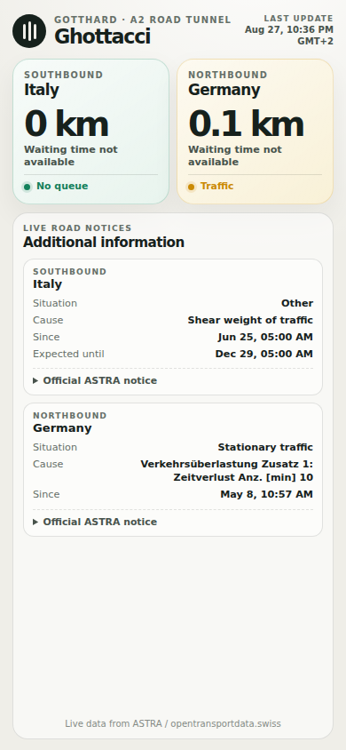

# Ghottacci

A tiny, mobile-first status page for queues at the Gotthard road tunnel. The name is a Roman-flavoured Gotthard / “mortacci tua” mash-up. The React frontend only talks to the local Express proxy. A token configured in `.env` never reaches the browser; a token entered in the app stays in that browser tab.

<p align="center">
  
</p>

## Local development

Requirements: Node.js 20.19 or newer. Request the **Road traffic - traffic situations** token from its [API Manager product page](https://api-manager.opentransportdata.swiss/portal/catalogue-products/tedp_road_traffic_traffic_situations_policy-1). You can configure it in `.env`, or enter it in the app when prompted.

```bash
npm install
cp .env.example .env
# Optionally add your token to .env
npm run dev
```

Open <http://localhost:5173>. Vite proxies `/api` calls to the backend on port `3001`.

Useful commands:

```bash
npm test       # parser tests
npm run check  # TypeScript checks
npm run build  # production frontend build
npm start      # production server on PORT, default 3001
```

## Configuration

| Variable | Required | Description |
| --- | --- | --- |
| `opentransportdata_api_key` | no | Server-side Bearer token. If omitted, the app asks the user for a token. A leading `Bearer ` is accepted. |
| `PORT` | no | HTTP port for the Express server. Defaults to `3001`. |
| `HOST` | no | Network interface for Express. Defaults to `0.0.0.0`, allowing connections from other hosts. |
| `CORS_ALLOWED_ORIGINS` | no | Comma-separated frontend origins, or `*`. Defaults to `*`. |
| `ASTRA_CACHE_TTL_SECONDS` | no | Minimum time between upstream ASTRA calls. Defaults to `180` seconds and cannot be lower than `30`. |
| `VITE_API_BASE_URL` | no | Public backend URL used when the frontend is hosted separately, such as `https://traffic-api.example.com`. |

## Deployment

This is a single Node service. Optionally set `opentransportdata_api_key` in the host's secret/environment settings, then use:

```bash
npm ci
npm run build
npm start
```

Expose the configured `PORT`. The Express server serves both `/api/traffic` and the built React app from `dist/`, so no separate frontend deployment or CORS setup is needed.

The production server listens on all network interfaces by default, and Vite development already accepts connections from other hosts. For a split deployment, set `VITE_API_BASE_URL` before `npm run build`. CORS allows all origins by default; for a public deployment with a known frontend, restrict it instead:

```bash
CORS_ALLOWED_ORIGINS=https://traffic.example.com,https://www.traffic.example.com
VITE_API_BASE_URL=https://traffic-api.example.com
```

The proxy calls the official DATEX II SOAP endpoint, filters active A2 records mentioning Gotthard, Göschenen, or Airolo, and caches results for three minutes by default. Failed attempts receive the same cooldown. This stays comfortably below the product's published limit of 5 calls per minute and prevents repeated refresh attempts from consuming the quota. The UI refreshes every four minutes and also supports pull-to-refresh on touch devices. If ASTRA fails after a successful request, the API returns the last cached snapshot as stale data and retains its original update time.

If no server token is configured, the app opens an API-key dialog. A user-entered token is sent to the proxy in a request header and stored only in `sessionStorage`, so it is removed when the browser tab is closed. Always deploy over HTTPS when using this mode.

## Data interpretation

DATEX II messages can contain structured queue/delay fields or human-readable multilingual traffic text. The parser supports both. Direction is taken from destination wording (Chiasso/Italy or Basel/Germany) and falls back to the portal: Göschenen is southbound and Airolo is northbound. When multiple active records exist for one direction, the largest queue and delay are shown.

The two compact direction cards keep queue length, waiting time, and severity visible at a glance. A separate lower panel shows optional DATEX details for both directions: situation type, cause, restricted lanes, validity window, and a collapsible official public traffic notice. Missing fields are simply omitted.

Source: [ASTRA traffic situations documentation](https://opentransportdata.swiss/en/cookbook/road-traffic-cookbook/traffic-situations/).
